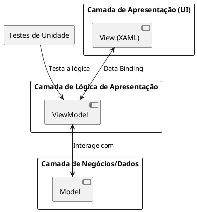
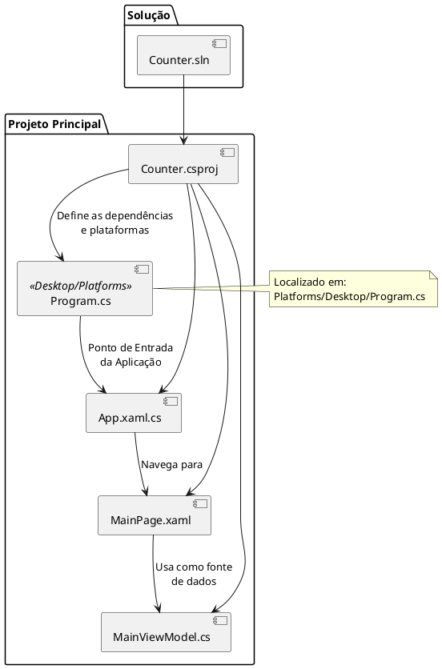
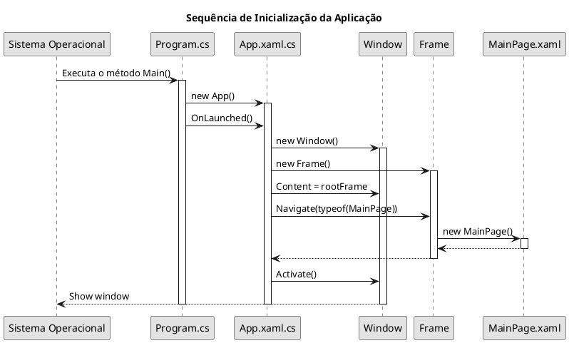
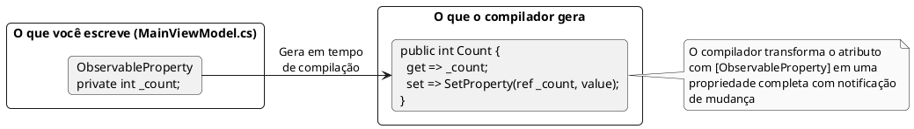
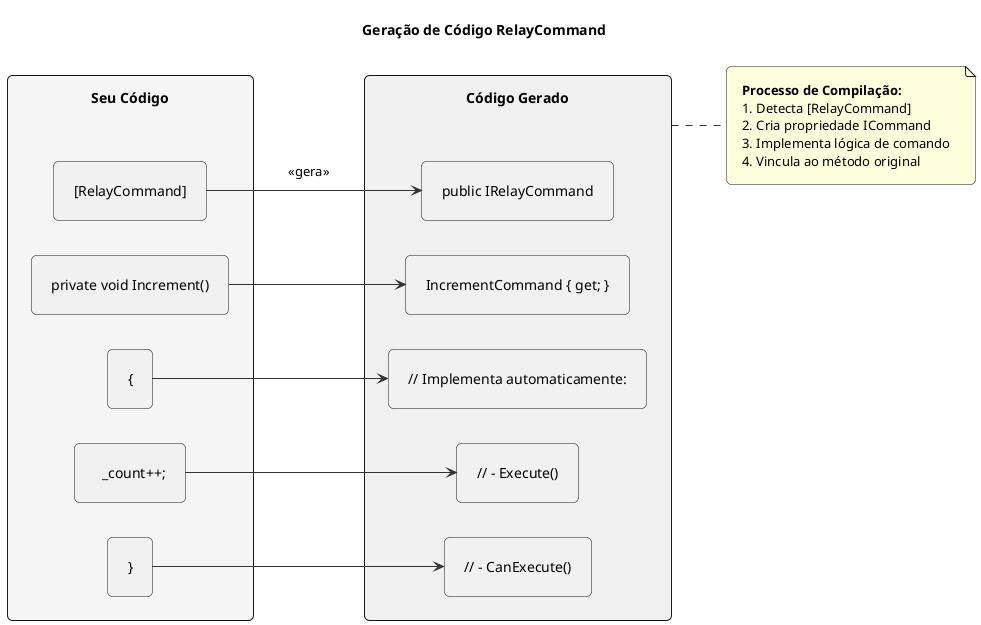

# Counter 

---

## 1. O "Porquê" da Arquitetura

Antes de analisar o código, é fundamental entender *por que* projetos modernos usam padrões como o **MVVM (
Model-View-ViewModel)**. Os principais motivos são:

- **Testabilidade:** A lógica de apresentação (ex: o que acontece quando um botão é clicado) reside no ViewModel, que é
  uma classe C# pura. Ela não depende de nenhum elemento de UI. Isso significa que podemos escrever testes de unidade
  automatizados para verificar a lógica (ex: "se eu chamar o comando de incremento, o contador aumenta?") sem precisar
  simular uma interface gráfica.
- **Manutenibilidade:** Separar a UI (View) da lógica (ViewModel) torna o código mais fácil de entender, modificar e
  corrigir. Um designer pode alterar a aparência na View sem risco de quebrar a lógica de negócios, e um desenvolvedor
  pode refatorar a lógica no ViewModel sem afetar a UI.
- **Desenvolvimento Paralelo:** Com uma interface bem definida entre a View e o ViewModel, equipes de design de UI e de
  desenvolvimento de lógica podem trabalhar em paralelo.



## 2. Anatomia de um Projeto Uno Platform

Um projeto Uno Platform tem uma estrutura de arquivos bem definida. O diagrama abaixo ilustra os arquivos mais
importantes do nosso projeto `Counter` e como eles se relacionam.



- **`Counter.csproj` - O Arquivo de Projeto:** Este arquivo XML instrui o compilador sobre como construir seu projeto.
  As tags mais importantes são:
    - `<TargetFrameworks>net9.0-desktop</TargetFrameworks>`: Define para qual(is) plataforma(s) do .NET seu código será
      compilado. `net9.0-desktop` indica a versão mais recente do .NET para aplicações de desktop (Windows, macOS,
      Linux).
    - `<UnoFeatures>Mvvm;SkiaRenderer;</UnoFeatures>`: Uma funcionalidade da Uno Platform que adiciona automaticamente
      as dependências de pacotes necessárias para as funcionalidades listadas. `Mvvm` adiciona o
      `CommunityToolkit.Mvvm`, e `SkiaRenderer` adiciona o motor de renderização Skia.

## 3. O Ciclo de Vida da Aplicação

Entender como a aplicação inicia é fundamental. O fluxo a seguir detalha o processo para uma aplicação desktop.



1. **`Program.cs`**: É o ponto de entrada. Ele inicializa o `UnoPlatformHostBuilder`, que configura serviços essenciais
   para a plataforma.
2. **`App.xaml.cs`**: A classe principal da aplicação. No método `OnLaunched`, criamos a `Window` (a janela principal do
   sistema operacional) e um `Frame`.
3. **`Frame`**: É um controle de UI que gerencia a navegação entre páginas, similar a um navegador web. Ele mantém um
   histórico de navegação.
4. **`frame.Navigate(typeof(MainPage))`**: Esta linha instrui o `Frame` a criar e exibir uma nova instância da
   `MainPage`.

## 4. A View em Detalhes: Anatomia de um Arquivo XAML

O XAML é mais do que apenas uma forma de desenhar a UI; é uma linguagem rica para definir objetos e suas propriedades.

```xml

<Page
        x:Class="Counter.MainPage"
        xmlns="http://schemas.microsoft.com/winfx/2006/xaml/presentation"
        xmlns:x="http://schemas.microsoft.com/winfx/2006/xaml"
        xmlns:local="using:Counter"
        Background="{ThemeResource ApplicationPageBackgroundThemeBrush}">

    <Page.DataContext>
        <local:MainViewModel/>
    </Page.DataContext>

    <StackPanel>
        <TextBox Text="{Binding Step, Mode=TwoWay}"/>
        <Button Command="{Binding IncrementCommand}"/>
    </StackPanel>
</Page>
```

- **`xmlns` (XML Namespace):** Declarações de namespace. `xmlns` sem prefixo define o namespace padrão, de onde vêm tags
  como `<Page>` e `<Button>`. `xmlns:x` é para o namespace intrínseco do XAML, e `xmlns:local` cria um atalho para o
  namespace do nosso projeto, permitindo-nos referenciar `MainViewModel`.
- **`x:Class`**: Conecta este arquivo XAML à sua classe C# de "code-behind" (`MainPage.xaml.cs`).
- **`{ThemeResource}` vs. `{Binding}`**: Ambas são **Extensões de Marcação**.
    - `{ThemeResource}`: Procura um recurso (como uma cor ou um estilo) nos dicionários de recursos do tema atual da
      aplicação. Permite que a UI se adapte a temas claro/escuro.
    - `{Binding}`: Cria uma ligação de dados com o `DataContext` atual. É dinâmico e reage a mudanças nos dados.

## 5. O ViewModel: A Magia dos Source Generators

O `CommunityToolkit.Mvvm` usa **Source Generators** do .NET para reduzir drasticamente o código repetitivo. Você escreve
uma intenção com um atributo, e o compilador escreve a implementação para você.

**Diagrama do `[ObservableProperty]`:**



**Diagrama do `[RelayCommand]`:**



Esses geradores são a razão pela qual a classe `MainViewModel` é declarada como `partial` — o compilador adiciona a outra parte da classe com o código gerado durante a compilação.

## 6. Conclusão

Este guia aprofundado desconstruiu os componentes de uma aplicação Uno Platform, focando não apenas no "o quê", mas no "
porquê" e no "como". Os conceitos-chave abordados foram:

- **Arquitetura MVVM:** Como um pilar para código testável e manutenível.
- **Estrutura do Projeto:** O papel de cada arquivo, desde a solução até os componentes da UI.
- **Ciclo de Vida da Aplicação:** O fluxo de eventos desde a execução até a renderização da primeira página.
- **Anatomia do XAML e C#:** O funcionamento interno dos namespaces, bindings e a automação via Source Generators.

Com esta base conceitual, você está preparado para explorar, modificar e, finalmente, criar suas próprias aplicações multiplataforma robustas com a Uno Platform.
